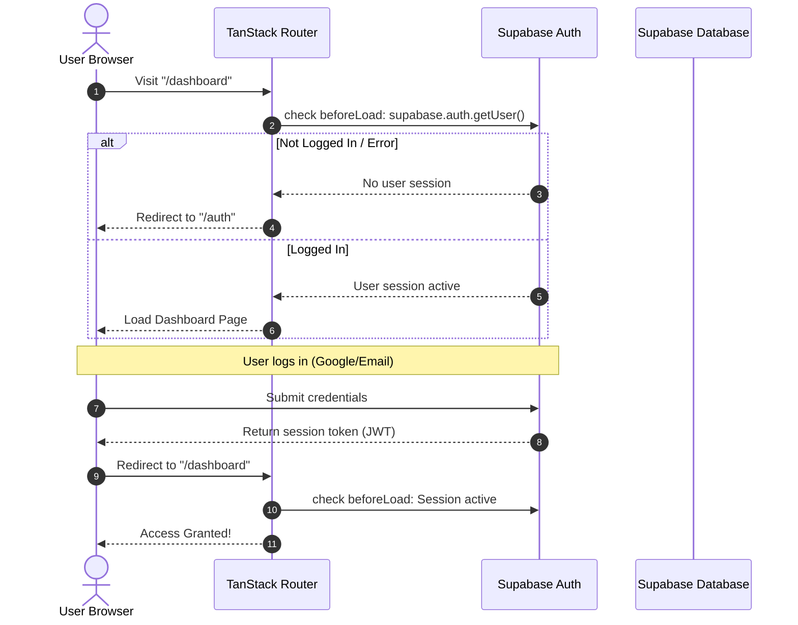
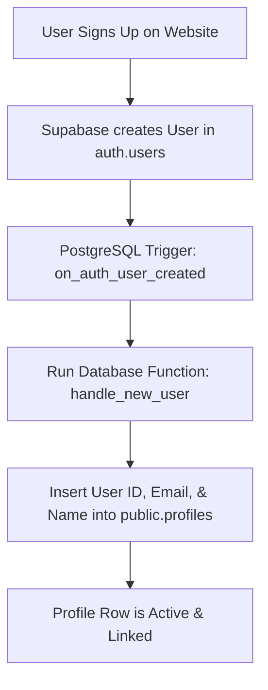
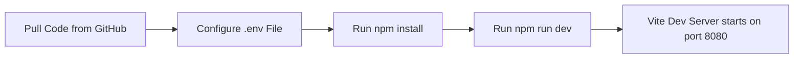
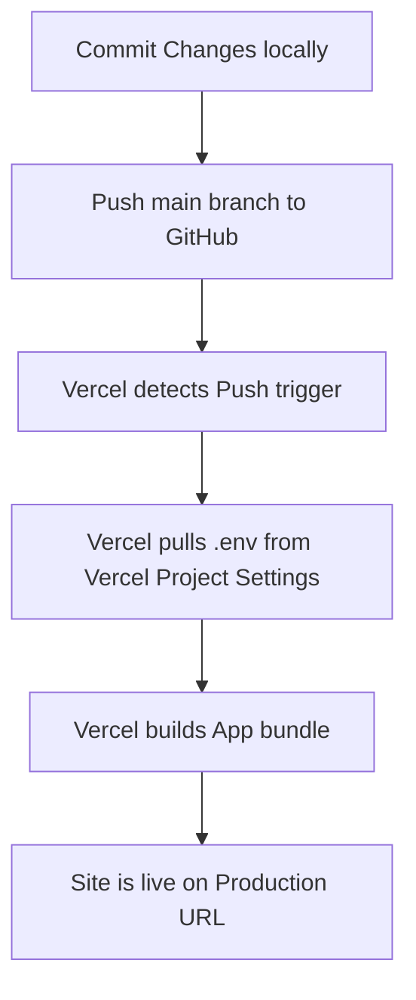

# WellAI Developer & System Workflow

This document outlines the detailed workflows of the WellAI system. It serves as a guide for understanding how user authentication, database operations, development, and deployment flows function together.

---

## 1. User Authentication & Route Guard Workflow

This workflow explains how a user logs in (via email/password or Google OAuth) and how the application protects authenticated pages from unauthorized access.

### Steps in Auth Workflow:
1. **Route Protection**: When a user attempts to access any route under `/dashboard`, TanStack Router's `beforeLoad` guard (defined in `src/routes/_authenticated/route.tsx`) checks the Supabase client for a valid user.
2. **Access Denied**: If no active user session is found, the user is redirected to the public `/auth` route.
3. **Access Granted**: If a session exists, the dashboard shell and sub-pages are rendered.
4. **Log-In**: From the `/auth` page, the user logs in. The session token is parsed and stored in the browser's `localStorage` (handling auto-refresh).
5. **Dashboard Transition**: Once logged in, the user is redirected back to the `/dashboard`.

---

## 2. Database Initialization & Trigger Workflow

This workflow explains what happens when a new user registers and how profiles are automatically created and linked.

### Steps in DB Workflow:
1. **User Registers**: The user signs up via email/password or Google. A user record is generated in Supabase's private `auth.users` table.
2. **Trigger Fires**: A database trigger (`on_auth_user_created`) immediately detects the new entry.
3. **Function Executes**: The trigger runs `public.handle_new_user()`.
4. **Profile Setup**: The function extracts metadata (such as the user's name and email) and inserts a new row into the `public.profiles` table with the same unique user ID.
5. **Data Linkage**: All subsequent tables (e.g. `chat_messages`, `skin_reports`, `habits`) reference this profile ID, ensuring Row Level Security (RLS) policies work correctly.

---

## 3. Local Development Workflow

This workflow shows how developers run, modify, and test the project on a local machine.

### Steps in Local Dev:
1. **Project Setup**: Clone the repository and install the dependencies using `npm install`.
2. **Environment Configuration**: Create a local `.env` file containing the Supabase URL and Publishable Key. (Note: `.env` is ignored by Git to prevent API key leaks).
3. **Server Startup**: Run `npm run dev`. Vite spins up the development server on `http://localhost:8080/`.
4. **Live Code Editing**: Code changes are instantly applied to the running local site via Hot Module Replacement (HMR).

---

## 4. Production Deployment Workflow

This workflow details how changes are committed, pushed, and built on Vercel for production.

### Steps in Deployment:
1. **Commit**: Save your changes in Git (ensure sensitive files like `.env` are untracked).
2. **Push**: Push the `main` branch to your GitHub repository.
3. **Vercel Build**: Vercel automatically detects the push, triggers a new deployment, installs dependencies, and runs the build script (`vite build`).
4. **Environment Variables**: During the build, Vercel injects the production Supabase keys (configured in your Vercel Project Dashboard).
5. **Production Live**: Once the build completes, the updated application is live on your production URL.
